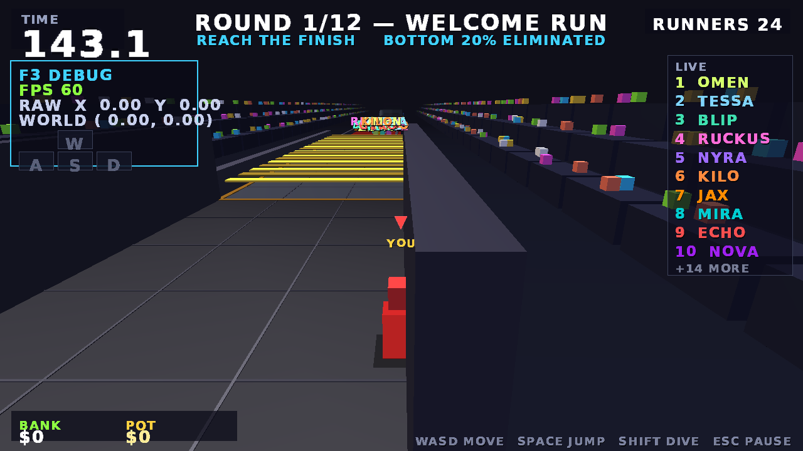

# LAST ONE RICH! — Season 1

A "viral mega-challenge show" competition game (original fictional branding, MrBeast-style *energy*),
built with **C# / .NET 8 + MonoGame DesktopGL** — Visual Studio only, code-first, data-driven.

The GDD §19 vertical slice has been expanded into the **full 12-round Season 1**, then given a
full **graphics + polish pass** (3-light rig, baked static meshes, visual language, fixed-step
render interpolation, drop shadows, name tags, HUD upgrade):

> intro cutscene (tokenized JSON template) → 12 rounds across 6 game modes →
> results ceremony + data-driven elimination → Bank vs Risk → cash-out offers →
> the Auction of Doom intermission → twist reveals → grand-finale "The Button" → champion ending

The whole season is machine-verified: the headless harness simulates all 12 rounds with the
real physics/AI/scoring code — **ALL CHECKS PASSED ✔**, exit code 0.

Everything visual is primitives + a generated bitmap font; everything audible is generated WAVs.
**No Content Pipeline (.mgcb), no external editor, no native tools** — build and run.



---

## 1) Quick start

### Prerequisites
- [.NET 8 SDK](https://dotnet.microsoft.com/download/dotnet/8.0) (8.0.400+)
- Visual Studio 2022 (workload: *.NET desktop development*) — or just the `dotnet` CLI

### Run (Visual Studio)
1. Open `LastOneRich.sln`
2. Set **LastOneRich** as the startup project
3. F5

### Run (CLI)
```bash
dotnet run --project src/LastOneRich -c Release
```

### Headless validation harness (CI / balance testing)
Simulates real races with the *same physics + AI code* the game uses (no GPU, no window):
```bash
dotnet run --project src/HeadlessSim -c Release
```
Current result: **full 12-round season — ALL CHECKS PASSED ✔** (per-round verdicts,
roster shrink 24→3, champion line, exit 0). It verifies the season/twist/level validator,
every mode's scoring/elimination, and the **camera input-axis acceptance check**
(cam.RightDir must equal screen-right for the chase cam — the A/D regression gate).

| flag | effect |
|---|---|
| `--debug` | 5s position trace per round + per-round verdicts |
| (removed) `--fine` / `--who` | replaced by the full-season harness |

### Dev launch flags (game)
| flag | effect |
|---|---|
| `--goto=menu` | skip the studio splash |
| `--goto=intro` | jump straight into the intro cutscene |
| `--goto=game` | jump straight into Round 1 gameplay |
| `--round=N` | with `--goto=game`: start at season round N (1–12; 10 = Auction) |

The game runs a **fixed 60 Hz simulation** with **render interpolation** (actors are drawn
lerped between the previous and current physics step — no physics/render jitter), an
exponentially smoothed chase camera, and **explicit render-state isolation** between the
3D passes and every SpriteBatch/UI pass.
| `--overlay` | start with the F3 debug overlay visible |
| `--shot=path.png --shot-frame=N` | save a screenshot at frame N, then exit |
| `--safe` | neither read nor write `saves/settings.json` for this run, so a saved display mode can never lock you out of booting |

`--safe` is also what the game does **by itself** if a launch that applied a non-default
resolution/fullscreen never reached its first rendered frame: `saves/.boot-probe` is armed before
the device is created and cleared by the first successful `Draw`, and a leftover probe means
"boot once with the settings ignored" (the file stays intact and is retried next launch).

### Settings (menu ▸ SETTINGS, or pause ▸ SETTINGS)

One screen, two entry points (`States/SettingsScreen.cs`), four tabs:

| tab | rows |
|---|---|
| GRAPHICS | resolution (6 modes), fullscreen, VSync, FOV 50–100°, fog |
| AUDIO | master / music / SFX volume, 0–100 |
| CONTROLS | mouse sensitivity (% of default), invert Y, camera distance |
| GAMEPLAY | difficulty — CASUAL / STANDARD / HARDCORE (rival pace + drone patrol speed; player physics untouched) |

Everything is stored in the **existing** `ControlsDTO` (`Keybinds.Settings`) — no second settings
model — and persisted to `saves/settings.json` beside `saves/save.json`. `content/data/controls.json`
stays the shipped default; the save file overlays it at startup, field by field, and always wins.
Edits save as you make them and apply live (audio faders, FOV, fog, VSync, camera, sensitivity,
difficulty-on-next-round) except **resolution / fullscreen**, which queue behind an
`APPLY & RESTART` prompt because flipping the swapchain under a live player is never a surprise
you want. Hand-editable extras: `cameraHeight`, `pitchMinDeg`, `pitchMaxDeg`.

### Career save (Priority 4)

`saves/save.json` is now **versioned** (schema v2: round/podium/win stats, best bank, achievement
list) with forward **migration** from v1 files, written **atomically** (temp file + rename, with
the previous good write kept as `save.json.bak` and used as automatic fallback). A crash or a
hand-edit can never tear the career file; quitting flushes best-effort via `LorGame.OnExiting`.

### Achievements (Priority 5)

Ten Season-1 achievements (`Core/Achievements.cs`), evaluated once per round at the results
ceremony and at the season choke points (bank/risk decision, cash-out, champion) — never polled
per frame. Unlocks persist into `save.json` immediately, sting the crowd, and ride a golden
toast above whatever state is on screen. The main menu gained an **ACHIEVEMENTS** trophy case
(earned = gold, locked = `???`). One anchor was deliberately provisional: `glass_perfect`
meant "finish Round 6", with a `PRIORITY 6 NOTE` in `Achievements.EvaluateRound` marking
where it re-anchors to `TilesBroken == 0`. Priority 6 closes that note.

### Breakable glass (Priority 6)

Round 6 **GLASS PATH MEMORY** is now a real puzzle instead of scenery. `World/BreakTiles.cs`
adds `BreakTile`, following the existing `Hazards.cs` pattern and cycling
`Solid → Cracking → Shattered → Reforming`. A pane owns its collider and detaches it on
shatter, so the hole is physically real. `Actor.TilesBroken` counts the panes that go down
under you, and `glass_perfect` now requires `Finished && TilesBroken == 0`.

Each row has exactly one safe pane (invariant enforced in `Level.BuildBreakTiles`, seeded by
`glassSeed` so a round is reproducible). Panes reform after `reformTime`, which matters more
than it sounds: with reform disabled, the opening stampede permanently destroyed the fake panes
in row 0 and the course became unfinishable for everyone who respawned behind it.

Bots read the glass through `BotController.UpdateGlassBrain`, gated on `PuzzleSkill`. They may
guess wrong, fall, respawn and try again exactly like the player, and a pane someone has already
proved safe becomes public knowledge the rest of the field will follow. Hesitation is modelled as
a ground-only "remembering" beat — a contestant cannot recall the pattern mid-air — so low skill
means lingering on glass, and lingering is what drops you through it.

New world-space particles (`Core/WorldParticles.cs`, a 512-slot allocation-free pool) throw shards
on shatter, and four generated cues (`glass_crack`, `glass_break`, `glass_land`, `glass_reform`)
ship via `tools/make_audio.py`. The HUD gains a glass panel reading `GLASS n/12 · FLAWLESS` until
your first break.

Tuning was driven by a headless simulation of the round rather than by eye. Across 12 seeds the
course yields 5-6 finishers out of 7, a flawless run is available in 12/12 seeds, and panes broken
correlates with `PuzzleSkill` at **r = −0.84**.

---

## 2) Controls (GDD §4)

| action | keyboard | gamepad |
|---|---|---|
| Move | WASD / arrows | left stick |
| Jump | Space | A |
| Dive (burst dash, cooldown) | Shift | X |
| Confirm / skip | Enter / Space / E | A |
| Menu choice | ← → or 1 / 2 | d-pad / bumpers |
| Pause | Esc | Start |
| Debug overlay | F3 | — |

### Remapping keys — `content/data/controls.json`
```json
{ "moveLeft": ["A", "Left"], "moveRight": ["D", "Right"], "moveForward": ["W", "Up"],
  "moveBack": ["S", "Down"], "jump": ["Space"], "dive": ["LeftShift", "RightShift"], ... }
```
Edit, save, restart. Invalid names are ignored; delete the file to get defaults back.

### Movement model (important)
Input is **camera-relative**: keys/stick produce *screen-space intent* which
`GameplayState.ResolveMove` converts to world XZ using the live chase-camera basis —
so **A is always screen-left and D always screen-right**, at every camera yaw.
The F3 overlay shows RAW intent vs WORLD direction, plus FPS and WASD indicators.

---

## 3) Season 1 — the 12 rounds

| # | round | mode | elimination |
|---|---|---|---|
| 1 | WELCOME RUN | Race (obstacle course) | TimeTrialRankCut 20% |
| 2 | SHRINKING SPOTLIGHT | SurvivalZone (spotlight shrinks) | ScoreRankCut 25% |
| 3 | DRONE DODGE | StrikesOut (3 scans = out) | StrikesOut (+percent fallback) |
| 4 | PRIZE SHOP MAZE | Race through conveyor maze | TimeTrialRankCut 8% |
| 5 | BLOCK BOOM TOWER | ScoreCollect (vault→deposit bricks) | ScoreRankCut 8% |
| 6 | GLASS PATH | Race on stepping stones | TimeTrialRankCut 8% |
| 7 | TRIVIA GATES | Race through trivia door walls | TimeTrialRankCut 8% |
| 8 | THE HEIST | ScoreCollect under hammers | ScoreRankCut 8% |
| 9 | FREEZING ROOM | SurvivalZone on ice | ScoreRankCut 25% |
| 10 | THE AUCTION OF DOOM | intermission — buy upgrades | — |
| 11 | MEGA GAUNTLET | Race remix of rounds 1–9 | TopNAdvance (top 3) |
| 12 | THE BUTTON | FinaleButton (king-of-the-hill) | last-one-standing wins |

Season shape: 24 contestants (6 rivals + 17 fill bots + YOU), roster shrinks to a
3-contestant Button finale. Twist pools per round, cash-out offers after rounds 2/4/6/8,
five auction items (shield, sabotage, extra life, golden ticket, twist preview).

### Modes (all in `World/Modes.cs`, pure data + code)
- **Race** — waypoint course, checkpoint respawns, finish-time ranking.
- **SurvivalZone** — score = seconds inside a shrinking spotlight; elimination by score rank.
- **StrikesOut** — scanner drones patrol bands; each scan = 1 strike (6 s immunity),
  3 strikes = out; bots dodge by crossing behind the sweep.
- **ScoreCollect** — grab bricks at the vault (carry cap 3, carrying slows you ×0.62),
  deposit for cash; most banked wins.
- **FinaleButton** — stand on the button to drain rivals' scores (1.5/s per presser);
  standing drains stamina (burnout → forced off 5 s); waiting off-button builds score.

### Visual language (Core/ColorPalette.cs — one identity per object class)
charcoal floors · grey barriers · **green = safe/finish** · **glowing orange = hammers** ·
glowing blue = wind · yellow = conveyors/bricks · pale cyan = ice · teal = safe stones ·
deep red = danger pads · white drones with **glowing red scan rotors** · bright red YOU.
The static world (geometry, crowd, floor grid, edge-warning curbs, hazard decals) is **baked
once at load** into a single vertex buffer; hazards/interactives batch into an **unlit glow
pass** so they pop in shadow. Actors render with a fake height-scaled drop shadow and
world-to-screen name tags; the player has a subtle red emissive body. Fog (90→240) matches
the near-black-blue sky. Fixed rival palette: NOVA purple, JAX orange, MIRA teal, TANK slate,
LUXE gold, PIXEL pink.

### Finalization guarantees
- Unknown/unimplemented round modes fall back to Race rules with a warning HUD (never crash).
- Bot stuck-recovery fires after 1.5 s; falls respawn at the last checkpoint with synced render state.
- Timer pulses red under 15 s; twist banner drops in at round start colored by severity.
- Leaderboard caps at 10 rows (+N more), highlights YOU, greys out eliminated runners.
- HeadlessSim verifies all 12 rounds deterministically — exit 0 = shippable.

### What was in the slice (still true)

- **Level 1 "WELCOME RUN"** — pure JSON (`content/data/levels/level01.json`): start pad,
  twin conveyor belts, two rotating hammers, a hammer gauntlet, stepping stones through a
  slime slow-pool, two moving-platform ferries over a void, a pulsing headwind + crosswind
  stretch, and ramped finish plaza with prize podium and confetti crowd.
- **Player controller** — arcade run/jump/air-control/dive with coyote time, jump buffering,
  step-up ledges, moving-platform carry, forgiving respawns at checkpoints.
- **Waypoint bots (GDD §10)** — Dijkstra over a waypoint graph, personality-weighted route
  risk, honest jump-ballistics timing, platform waits/centering, stumbles, comedic bumps,
  stuck recovery. 6 rivals: NOVA, JAX, MIRA, TANK, LUXE, PIXEL (`content/data/bots.json`).
- **Elimination system (GDD §11.2)** — `TimeTrialRankCut` (bottom 20%) as pure data + code.
- **Results ceremony** — dramatic rank reveal, ELIMINATED stamps + stinger, payout breakdown.
- **Economy (GDD §6)** — BankedCash (safe) vs RiskedCash (prize pot), payout formula
  (base + placement + top-half + speed bonus), **Bank vs Risk ×2** decision, **cash-out
  offer** ($60k walk-away ending), $1,000,000 champion ending, elimination ending. `save.json` persists career stats.
- **Twists (GDD §14)** — data-driven modifiers with a **validator** (bounds, conflicts,
  round gates). The validator's caps double as difficulty floors for slowdown effects.
- **JSON cutscene player (GDD §9)** — timed beats: camera moves (lerped, smoothstepped),
  speaker subtitles, prize overlays, audio stingers, confetti events.
- **State machine (GDD §18.1)** — Boot → Menu → Intro → Gameplay → Results → BankRisk →
  CashOut → TwistReveal → Gameplay → … → SeasonEnd → Menu.
- **Update order (GDD §18.3)** — input → player → AI → platforms → hazard effects →
  collision integration → scoring/elimination → camera → UI.

---

## 4) Project layout

```
last-one-rich/
├── LastOneRich.sln
├── build.sh                        # sandbox/CLI build helper
├── tools/                          # asset generators (Python + Pillow)
│   ├── make_font.py                #   bitmap font atlas + metrics  -> content/gfx/font.*
│   ├── make_gfx.py                 #   particle / white pixel       -> content/gfx/*.png
│   └── make_audio.py               #   all SFX + music loop (WAV)   -> content/sfx/*.wav
├── content/                        # all data-driven content (copied to output, no .mgcb)
│   ├── data/
│   │   ├── season.json             # 12 rounds, twist pools, cash-out offers, grand prize
│   │   ├── economy.json            # payout formula params + auction items
│   │   ├── bots.json               # rivals + fillNames/fillCount (24-strong cast)
│   │   ├── twists.json             # modifiers + validator caps (belt/wind/hammer/slime/ice/drone/timer)
│   │   ├── controls.json           # remappable keybinds
│   │   └── levels/level01..12.json # one JSON per round (round 10 = auction, no file)
│   ├── cutscenes/intro_template.json # tokenized beats ({ROUND_NUM}, {MODE_OBJ}, cameraOrbit…)
│   ├── gfx/  sfx/                  # generated at build-time by tools/
└── src/
    ├── LastOneRich/
    │   ├── Core/                   # game loop, state machine, input, camera, renderer,
    │   │                           # bitmap font, audio, particles, save, JSON loader
    │   ├── World/                  # DTOs (JSON schema), physics, collision, hazards,
    │   │                           # waypoint AI, bot/player controllers, race rules, Level
    │   ├── Season/                 # SeasonRun, Wallet, payout formula, TwistValidator
    │   ├── Cine/                   # cutscene player
    │   └── States/                 # Boot, MainMenu, IntroCutscene, Gameplay, Results,
    │                               # BankRisk, CashOut, TwistReveal, SeasonEnd + HUD
    └── HeadlessSim/                # GPU-free race simulator + content validator (CI gate)
```

### Design notes (why it's built this way)
- **World layer is GPU-free.** `Actor`, `CollisionWorld`, hazards, `BotController`,
  `RaceTracker` reference no Xna Graphics types — the headless sim reuses them 1:1,
  so "bots can finish the level" is a *testable fact*, not a hope.
- **No Content Pipeline.** JSON is read with `System.Text.Json`; PNGs via
  `Texture2D.FromStream`; WAVs via `SoundEffect.FromStream`. All assets are regenerated
  placeholders — replace `content/gfx/*` and `content/sfx/*` with real art/audio later
  without touching code.
- **Rendering baseline:** per-face normal vertices + `BasicEffect` directional lighting
  (ambient + key light), explicit render states per pass (Opaque/AlphaBlend + depth),
  MSAA (`PreferMultiSampling`), Reach profile for max hardware compatibility.
- **Collision** is custom AABB with axis-separated resolve *using the min-penetration axis*
  (this exact bug class was found and fixed via the headless harness), step-up ledges,
  ramp height-fields, platform carry.
- **All JSON is hot-editable** — change a hammer speed or slime zone and re-run; no rebuild
  needed (content is copied at build; run `dotnet build` once after edits).

---

## 5) GDD coverage map

| GDD section | where |
|---|---|
| §3.1 Story campaign (slice: 3 rounds) | `content/data/season.json` |
| §4 feel/controller | `src/LastOneRich/World/PlayerController.cs`, `Phys.cs` |
| §5 core loop | `States/*` chain |
| §6 economy/prizes/cash-out | `Season/SeasonRun.cs` (Wallet, payout), `States/BankRisk*`, `CashOut*`, `SeasonEnd*` |
| §7 characters | `content/data/bots.json` + host/co-host/announcer lines in states & cutscene |
| §8 levels 1–12 | `content/data/levels/level0*.json`, `level1*.json` |
| §9 cutscene timelines | `content/cutscenes/intro_template.json`, `Cine/CutscenePlayer.cs` (tokens + cameraOrbit) |
| §10 waypoint bots + personalities | `World/WaypointGraph.cs`, `World/BotController.cs` |
| §11 hazards & elimination | `World/Hazards.cs`, `World/Hazards2.cs` (DroneScanner, IceZone), `World/Modes.cs` + `Elimination.Resolve` (StrikesOut / ScoreRankCut / TopNAdvance / TimeTrialRankCut), `World/RaceTracker.cs` |
| §12 broadcast HUD | `States/GameplayState.cs` (HUD), `ResultsState` |
| §13 data-driven content | `World/DTOs.cs`, `Core/Json.cs`, `content/data/**` |
| §14 AI-created content guardrails | `Season/TwistValidator.cs` + HeadlessSim |
| §15 audio | `Core/AudioBank.cs`, `content/sfx/*` (EDM loop, stingers, crowd) |
| §17 save/progression | `Core/SaveSystem.cs` → `saves/save.json` — versioned, atomic, `.bak` fallback (Priority 4); achievements in `Core/Achievements.cs` (Priority 5) |
| §18 architecture | `Core/StateMachine.cs`, `Core/LorGame.cs` (update order) |

---

## 6) Roadmap from here (suggested order)

1. **Scale content, not code**: author levels 2–12 as JSON from templates; the Level loader
   already supports all needed primitives. Add `DroneScanner` + `LaserGate` + `BreakTile`
   hazard classes (they fit the existing `Hazards.cs` pattern).
2. **More elimination rules**: `ScoreRankCut`, `LastNStanding`, `StrikesOut`, `TeamCut`
   (slots already exist in `EliminationDTO.Rule`).
3. **Trivia/minigame states** for Level 7 (`questions_trivia.json` per GDD).
4. **Shop/auction intermissions** (Level 4/10) using `SpendStyle` personalities.
5. **Full 12-round arc**: extend `season.json`, add per-level cutscene JSONs, grand-finale
   "The Button" state.
6. **Replace placeholder assets**: font/UI theme, arena materials, contestant models —
   swap via Content Pipeline or keep runtime loading.

---

## 7) Known slice limitations

- Music is a 4-bar placeholder loop; host VO is text-only.
- Party Playlist & Practice modes (GDD §3.2/3.3) not started.
- Menu navigation is keyboard/gamepad only (no mouse hit-testing).
- Window resize keeps a fixed 1280×720 virtual canvas (letterboxed scaling).
